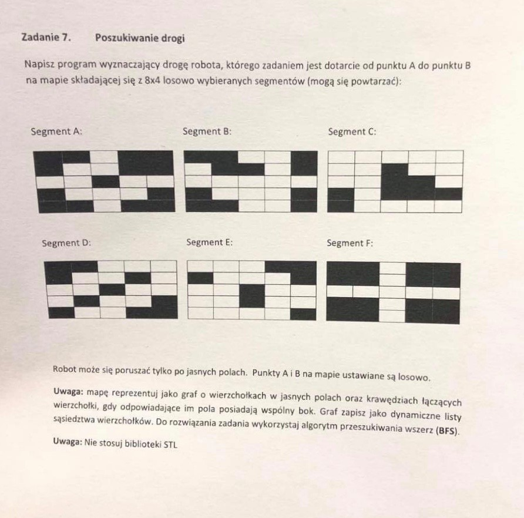

# Poszukiwanie drogi
> 

## Screenshots

## Technologie
* C++

## Problemy projektu
* stworzenie grafu opartego o dynamiczne listy sąsiedztw 
* algorytm przechodzenia wszerz (BFS)
* znalezienie optymalnej (najkrótszej) drogi między punktami

## Status
Projekt jest: _skończony_

## Inspiracja
https://eduinf.waw.pl/inf/alg/001_search/0126.php
